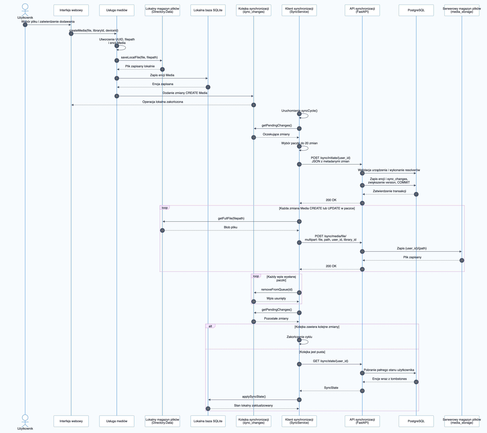
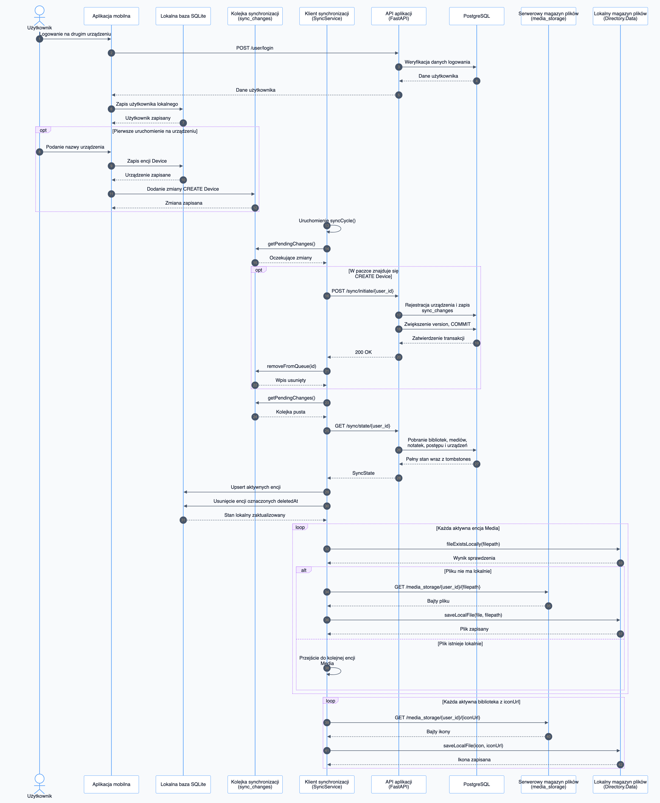
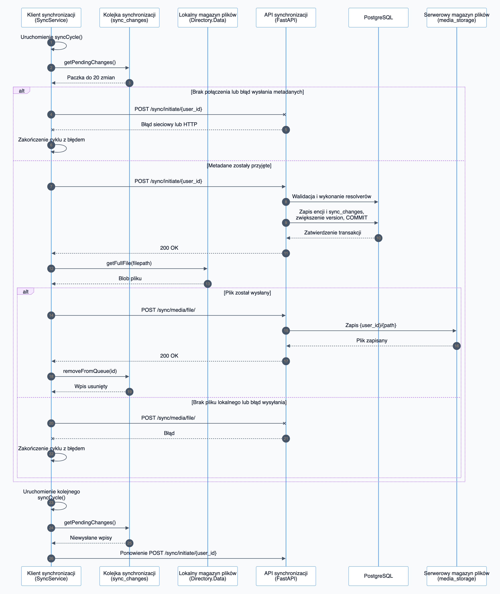

# Diagramy sekwencji synchronizacji

Diagramy przedstawiają przepływy synchronizacji systemu Continuum.

## Diagramy

1. `01-media-upload-push` — dodanie pliku lokalnego oraz wysłanie metadanych i pliku z urządzenia A.
2. `02-second-device-pull` — rejestracja urządzenia B, pobranie stanu i zapis brakujących plików lokalnych.
3. `03-offline-and-retry` — przebieg synchronizacji przy braku połączenia lub błędzie wysyłania.

## Podgląd

### 1. Dodanie pliku i PUSH



### 2. PULL na drugim urządzeniu



### 3. Praca offline i ponowienie



## Formaty

- `.mmd` — edytowalne źródło Mermaid,
- `.svg` — wersja wektorowa,
- `.png` — wersja rastrowa.

## Regenerowanie

Z katalogu `docs/sequence`:

```bash
npx --yes @mermaid-js/mermaid-cli -c mermaid-config.json -i 01-media-upload-push.mmd -o 01-media-upload-push.svg -b '#F8FAFC'
npx --yes @mermaid-js/mermaid-cli -c mermaid-config.json -i 01-media-upload-push.mmd -o 01-media-upload-push.png -b '#F8FAFC' -s 2

npx --yes @mermaid-js/mermaid-cli -c mermaid-config.json -i 02-second-device-pull.mmd -o 02-second-device-pull.svg -b '#F8FAFC'
npx --yes @mermaid-js/mermaid-cli -c mermaid-config.json -i 02-second-device-pull.mmd -o 02-second-device-pull.png -b '#F8FAFC' -s 2

npx --yes @mermaid-js/mermaid-cli -c mermaid-config.json -i 03-offline-and-retry.mmd -o 03-offline-and-retry.svg -b '#F8FAFC'
npx --yes @mermaid-js/mermaid-cli -c mermaid-config.json -i 03-offline-and-retry.mmd -o 03-offline-and-retry.png -b '#F8FAFC' -s 2
```
